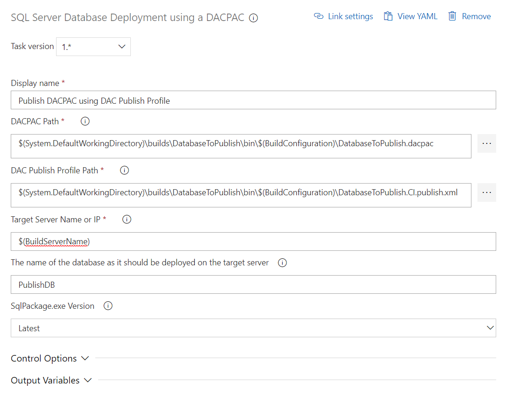
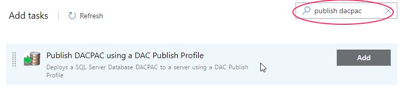
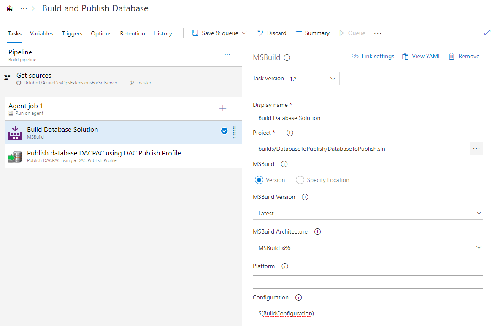
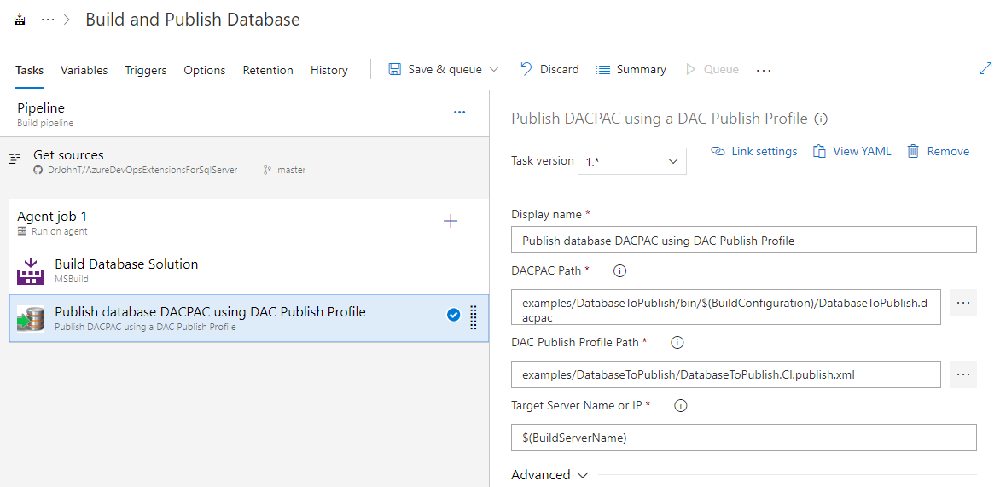
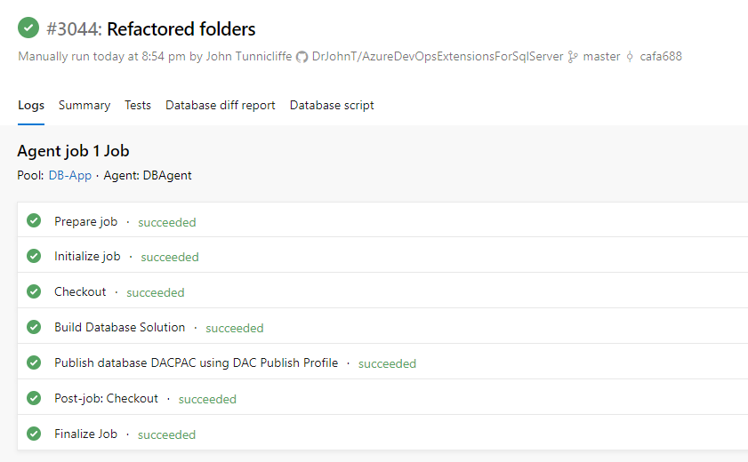
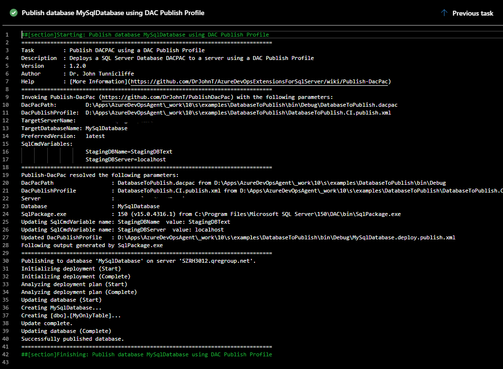

# Deploy database using DACPAC and DAC Publish Profile

The **Deploy Database** task allows you to deploy a SQL Server Database to a SQL Server instance using a DACPAC and a DAC Publish Profile.

SQL Server Data Tools (SSDT) is Microsoft's design tool to declare the entire database model including tables, views, stored procedures, functions, schemas, etc. etc. covering **all** aspects of the database design.

SQL Server Data Tools is now fully integrated into Visual Studio so that when you perform a **build** of a SSDT Visual Studio project, it creates a [DACPAC](https://msdn.microsoft.com/en-IN/library/ee210546.aspx) which defines all of the SQL Server objects - like tables, views, store procedures and functions - associated with a database.  Once you have a [DACPAC](https://msdn.microsoft.com/en-IN/library/ee210546.aspx), it can be deployed using the **Publish** function in Visual Studio, or by using the [SqlPackage.exe](https://docs.microsoft.com/en-us/sql/tools/sqlpackage) command-line interface.

The **Deploy Database** task simplifies the use of [SqlPackage.exe](https://docs.microsoft.com/en-us/sql/tools/sqlpackage) to deploy a [DACPAC](https://msdn.microsoft.com/en-IN/library/ee210546.aspx) by using a [DAC Publish Profile](https://github.com/DrJohnT/PublishDacPac/wiki/DAC-Publish-Profile) which provides for fine-grained control over the database creation and upgrades, including upgrades for schema, triggers, stored procedures, roles, users, extended properties etc. Using a [DAC Publish Profile](https://github.com/DrJohnT/PublishDacPac/wiki/DAC-Publish-Profile), multiple different properties can be set to ensure that the database is created or upgraded properly.

The **Deploy Database** task compares the content of a DACPAC to the database already on the target server and generates a deployment script. You can tailor how database publishing works by altering the content of your [DAC Publish Profile](https://github.com/DrJohnT/PublishDacPac/wiki/DAC-Publish-Profile).   See our guide to using the [DAC Publish Profile](https://github.com/DrJohnT/PublishDacPac/wiki/DAC-Publish-Profile) effectively.
Note that [DAC Publish Profiles](https://github.com/DrJohnT/PublishDacPac/wiki/DAC-Publish-Profile) are created in Visual Studio when you **Publish** a database.  Clicking the **Save Profile** button in the **Publish** screen saves your [DAC Publish Profile](https://github.com/DrJohnT/PublishDacPac/wiki/DAC-Publish-Profile) into your Visual Studio project for later re-use.

The **Deploy Database** task can be used to automate the deployment of databases, either as part of a build in an Azure DevOps pipeline, or as part of a server deployment using Azure DevOps Release Manager.   To deploy databases using [Octopus Deploy](https://octopus.com/) or other deployment service, you can utilise the PowerShell module [PublishDacPac](https://github.com/DrJohnT/PublishDacPac/) which underpins the **Deploy Database** task.  [PublishDacPac](https://www.powershellgallery.com/packages/PublishDacPac/) is available on the 

## Example Configuration

## Example Pipeline

To automate build and deployment of databases in Azure DevOps, you can use the MsBuild task to create DACPAC from your Visual Studio solution.  You can then add the **Deploy Database** task to deploy the DACPAC using your own custom [DAC Publish Profile](https://github.com/DrJohnT/PublishDacPac/wiki/DAC-Publish-Profile).

Below we show an example pipeline in Azure DevOps.  First MsBuild builds the project.  Second, the **Deploy Database** task deploys the database to your server.  Typically, as part of a build, this will be an instance on the actual build server machine.

Configure the MsBuild task by selecting the solution file path.

Note that it is best to configure a variable to hold the value of build configuration which is either **debug** or **release** as shown below.

Configure the settings for the **Deploy Database** task by entering the location that the previous step will place the DACPAC.

Save and queue your build. A few minutes later, you should see a screen like this in Azure DevOps.

Below is the output of the Deploy Database task for a very simple database.

