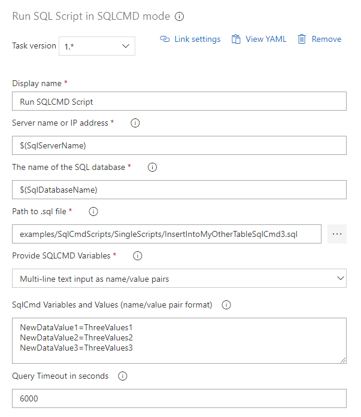
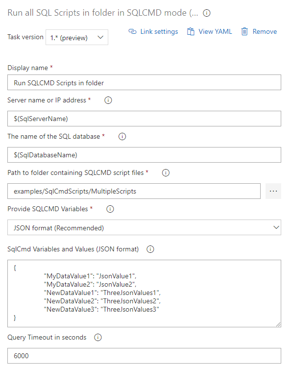

## Run SQL / SQLCMD Scripts against your database passing multiple SQLCMD variables

SQLCMD mode is a convenient way to parameterize your deployment SQL scripts.  This extension provides two pipeline tasks:

* Run single SQL Script in SQLCMD mode
* Run all SQL Scripts in a folder in SQLCMD mode

SQLCMD variables can be passed as name/value pairs in multiline text format, or as a basic JSON file.  We recommend the JSON format as the content is easier to validate in Visual Studio Code.

This extension can be used in a build or deployment pipeline to run pre- and post-deployment SQL scripts.

### Run single SQL Script in SQLCMD mode

The screenshot below shows the configuration options for the task.

### Run all SQL Scripts in a folder in SQLCMD mode

The screenshot below shows the configuration options for the task.

The SQL scripts are run in alphabetical order.  Simply rename the files with numeric prefixes to control the running order.  Note that only scripts with a .sql file-extension are executed. Other files in the directory will be ignored.

Setting _Recursive_ to true will cause the **Run all SQL Scripts in a folder in SQLCMD mode** task to run all the SQLCMD scripts it finds in the main folder and all sub-folders in alphabetical order.

### Example Pipeline

Below is a sample pipeline including the Run SQLCMD extensions.

